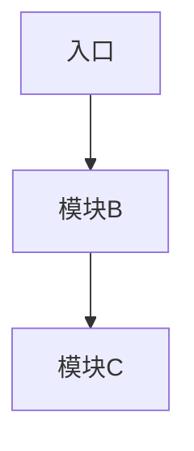

# 架构分析报告模板

产出报告时套用下面的骨架。**按情况裁剪**,某节实在没有内容就写「无」或删掉,不要硬凑。

````markdown
# <仓库名> 架构分析

## 1. 概览

- 一句话定位:这个项目是做什么的
- 技术栈:语言 / 主要框架 / 运行时
- 规模:文件数、代码行数量级、主要语言占比
- 依赖的外部服务(数据库、缓存、消息队列、第三方 API)

## 2. 目录结构与职责

| 目录 | 职责 | 关键文件 |
| --- | --- | --- |
| src/ | ... | ... |

（只列有意义的目录,不要罗列每个文件夹）

## 3. 启动与入口

- 入口文件是哪个,启动流程是什么
- 配置从哪里来、怎么注入
- 依赖是怎么装配起来的(手工 new / 容器 / 框架约定)

## 4. 模块依赖



- 依赖方向是否清晰、有无循环
- 核心模块(被依赖最多的)是哪几个、各自职责

## 5. 核心流程

挑一条主流程讲清楚(请求/命令从进来到出去),按步骤编号,标出每一步落在哪个模块。

## 6. 架构模式

- 判断它接近哪种模式(见 architecture-patterns.md)
- 符合的地方 / 偏离的地方

## 7. 风险与改进点

- 结构上的问题(上帝模块、层次混乱、重复代码、缺测试的目录…)
- 每一条都要能对上具体文件

## 8. 待确认

- 从代码看不出来的地方(需要作者/文档确认)
````

## 写作要求

- 结论后面**跟上依据**(文件路径、行号、代码片段)。
- 推断和事实分开表述:事实写「X 文件里 Y 是这样」,推断写「据此推测……(推断)」。
- 图只用 mermaid,便于在 Markdown 里直接渲染。
