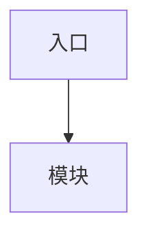

# 重构报告骨架

第 7 步的产出物。存到 `reports/<项目名>/refactor.md`。

````markdown
# <项目名> 重构方案

- **日期**:<日期>
- **依据纲领**:`reports/<项目名>/charter.md`(已确认 / 待确认)
- **现状版本**:<commit 或文件快照说明>

## 一、纲领摘要

三到五句话复述本次重构的核心决定:性质、方向、明确不做的范围、风格与规模上限。
让没读过纲领的人也能看懂下面的方案。

## 二、现状

来自 `scripts/size_report.py` 与结构扫描的数字:

- 文件数 / 行数 / 语言构成
- 最大的几个文件与目录
- 空文件、生成物、可疑残留
- 结构问题清单(每条指向 `文件:行`)

## 三、目标结构

```text
<目录树,每个文件标注职责与改动标记 [新] [移] [改] [保] [删]>
```

## 四、职责与改动清单

| 文件 / 类 | 职责 | 改动 |
| --- | --- | --- |
| | | |

## 五、依赖关系



注明:依赖方向是否单向、有无环、哪些层不依赖框架。

## 六、守门结论

按 `over-engineering.md` 逐条走的结果:

- 背景档位:<A / B / C / D>,依据:<……>
- 规模档位:<S / M / L / XL>,依据:<行数>
- 允许的目录深度与文件粒度:<……>
- 抽象准入核查:<逐个新增抽象给出「已有两个实现 / 迫近的第二实现 / 为隔离测试」中的哪一条>

### 否决清单

| 曾考虑的设计 | 否决理由 |
| --- | --- |
| | |

## 七、迁移路径

每一步都能独立验证、独立提交、独立回退。

1. **<步骤名>** —— 做什么、动哪些文件、怎么验证;依赖:<无 / 步骤 N>
2. ……

步骤超过五个时,同时产出 `task-orchestration` 格式的计划文件。

## 八、验收与回滚

- 行为不变的验证方式:<测试 / 手工会话清单 / 产物比对>
- 每步的回滚方式:<git revert / 保留旧实现并行>
- 不可逆操作清单:<如数据格式变更 —— 有的话必须单独提示>

## 九、待确认

方案中仍依赖用户判断或未获取信息的部分,逐条列出并说明影响。
````

写作要求:

- 每个结论都要能对上依据(文件、行号或扫描数字),不要空泛断言。
- 目标结构里**每个文件都要有职责说明** —— 只给目录名的树没有价值。
- 守门结论与否决清单**不能省**。它们是这份方案区别于一份普通"最佳实践套用"的地方。
- 事实与推断分开写,推断一律标注。
